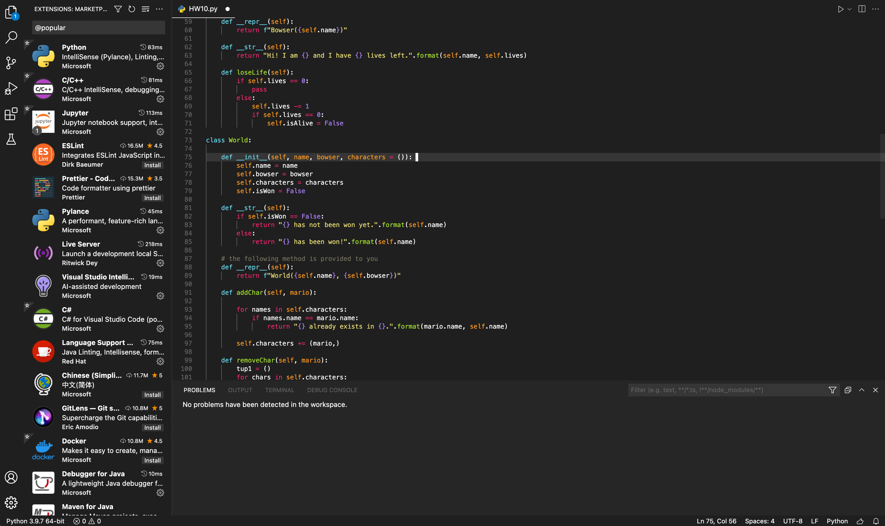
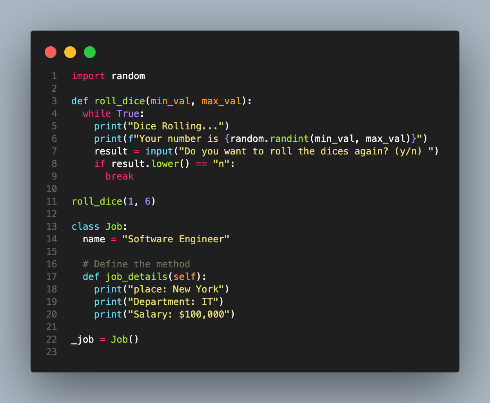
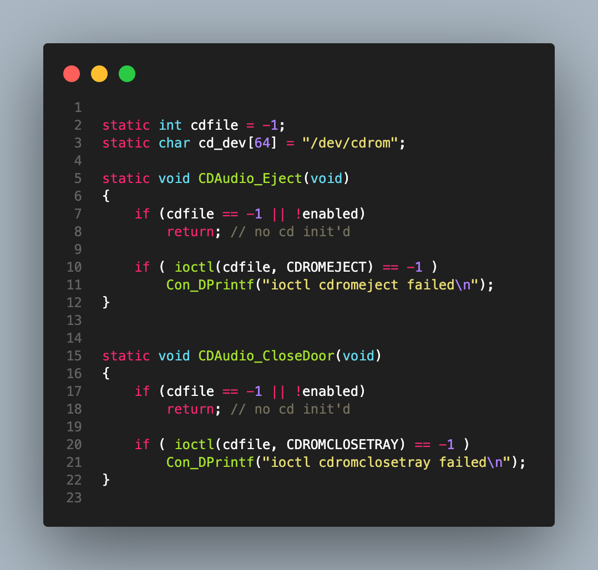
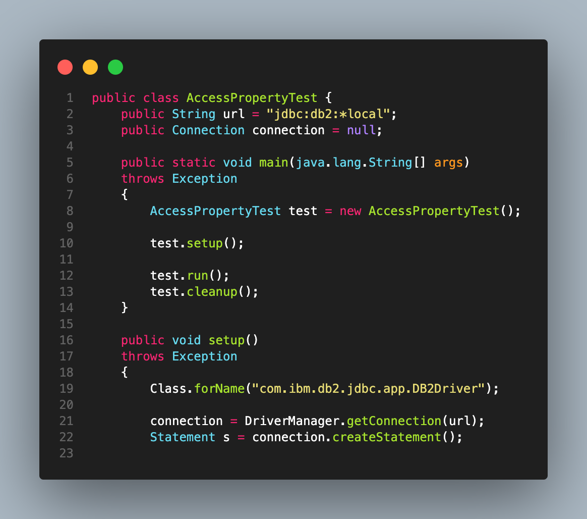

## Monokai Space Gray

Based on the original Monokai color scheme by Wimer Hazenberg and from Sublime Text. This is a revamped and redesigned
version of the theme with seamless design.

Main purpose of the design is to create a uniform and minimalist approach to the development environment including
consistent coloring across user interfaces.

## Color Scheme

**Python:**

**C:**

**Java:**

If you encounter a bug or to suggest an improvement, please report to Issues.

Thank you!

P.S I am currently working on the Light version of the theme. Will provide updates.
