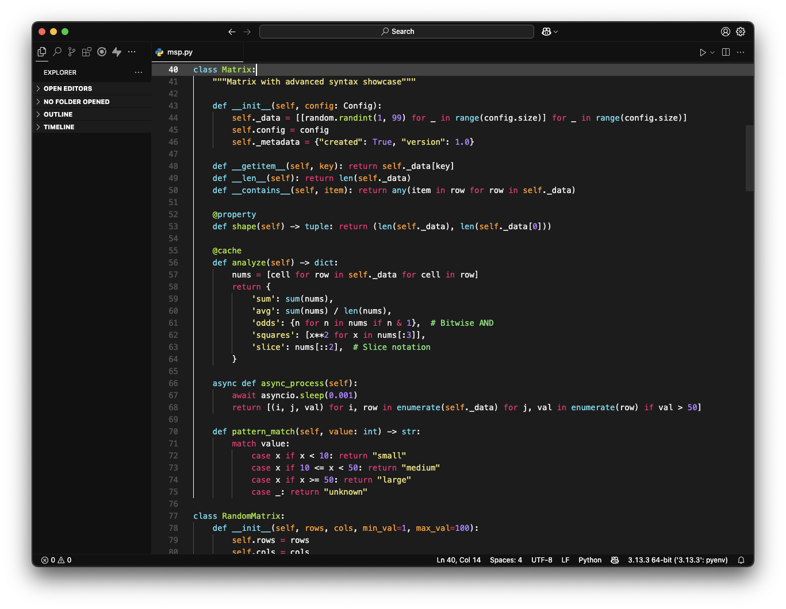

# Monokai Space Gray

  

<em>All colors are true to the original Monokai with consistent, uniform, and seamless design.</em>

## Project Summary

Minimal and vibrant color theme extension for Visual Studio Code that brings the classic Monokai color palette to your development environment. This theme provides carefully crafted syntax highlighting that stays true to the original Monokai design principles while offering a modern, consistent coding experience.

**Key Features:**
- True Monokai color palette that preserves the original aesthetic
- Universal language support with optimized syntax highlighting
- Eye-friendly design with balanced contrast for extended coding sessions

## Tech Stack

- **VS Code Extension API**
- **JSON** (theme configuration)
- **Node.js** (package management)
- **npm** (dependency management)

## Requirements

See `package.json` for all dependencies. Compatible with VS Code ^1.49.0+.

## VSCode Marketplace

**Marketplace Link:** https://marketplace.visualstudio.com/items?itemName=anand-ts.monokai-space-gray

---
Fall 2021